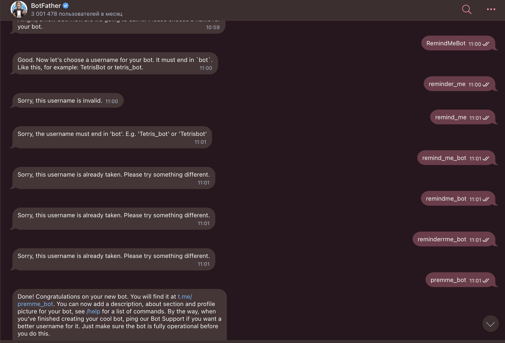
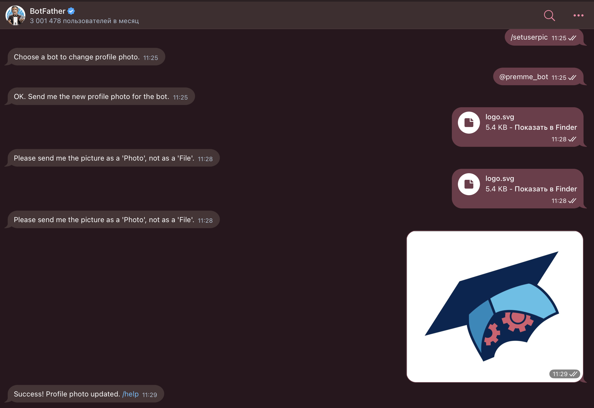
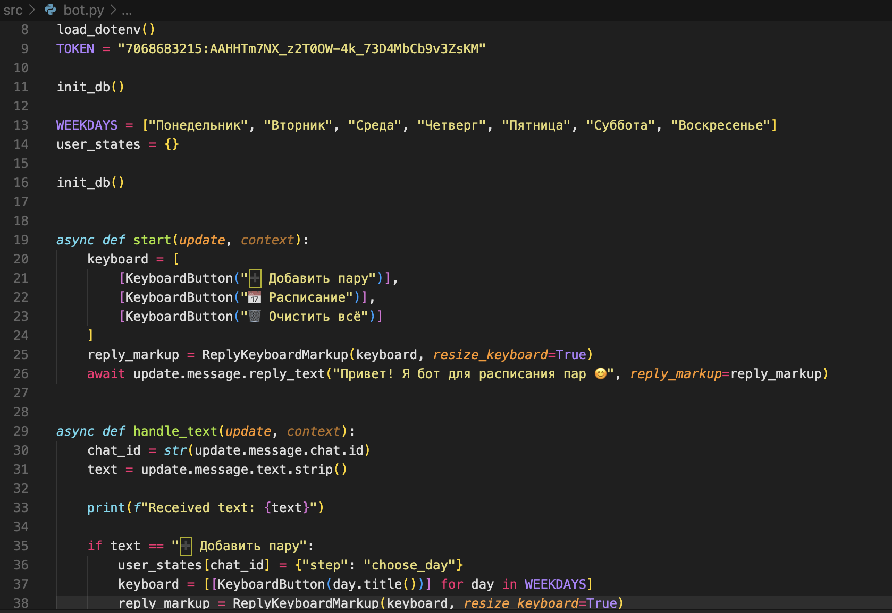
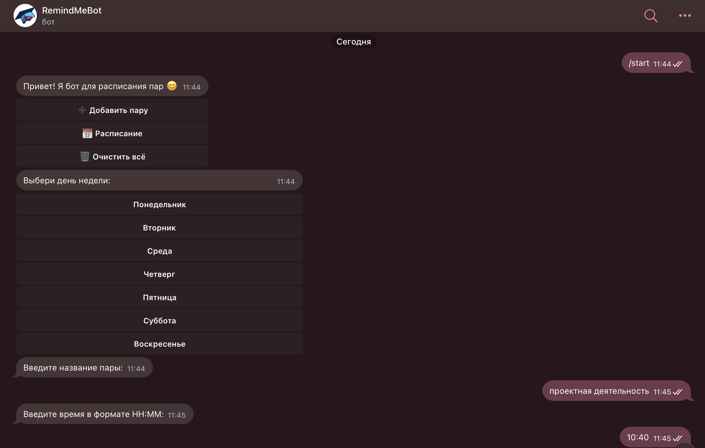

# Руководство по созданию Telegram-бота 

## Исследование предметной области

Проект «Цифровой ассистент преподавателя» направлен на упрощение преподавательской деятельности путём автоматизации рутинных задач. В результате анализа потребностей преподавателей были выявлены ключевые требования:

- Простая система для создания расписания  
- Возможность получать напоминания о занятиях  
- Удобный интерфейс и лёгкий доступ через Telegram  

В качестве базовой технологии выбран Telegram-бот на Python, так как это платформа, привычная пользователям и не требующая отдельной установки.

## Технологии

- Python 3.10+  
- Библиотека `python-telegram-bot`  
- SQLite для хранения данных  


---

## Пошаговая инструкция по созданию Telegram-бота

### Шаг 1: Регистрация бота в Telegram

1. Найдите в Telegram бота [@BotFather](https://t.me/BotFather)  
2. Отправьте команду `/newbot`  
3. Укажите имя и username (должен заканчиваться на `bot`)  
4. Получите токен API — сохраните его

 
  
---

### Шаг 2: Создание Python-скрипта

Создайте файл `bot.py`:

```python
from telegram import InlineKeyboardButton, InlineKeyboardMarkup, Update
from telegram.ext import Application, CommandHandler, CallbackQueryHandler, CallbackContext
import logging

# Логирование
logging.basicConfig(level=logging.INFO)

async def start(update: Update, context: CallbackContext):
    keyboard = [[InlineKeyboardButton("Расписание", callback_data='schedule')]]
    reply_markup = InlineKeyboardMarkup(keyboard)
    await update.message.reply_text('Привет! Я твой цифровой ассистент.', reply_markup=reply_markup)

async def button(update: Update, context: CallbackContext):
    query = update.callback_query
    await query.answer()
    if query.data == 'schedule':
        await query.edit_message_text(text="Вот твоё расписание: ...")

def main():
    app = Application.builder().token("ВАШ_ТОКЕН").build()
    app.add_handler(CommandHandler("start", start))
    app.add_handler(CallbackQueryHandler(button))
    app.run_polling()

if __name__ == '__main__':
    main()
```

  

---

### Шаг 3: Добавление напоминаний

Используем `asyncio` для периодических задач:

```python
import asyncio

async def remind():
    while True:
        # логика напоминаний
        print("Напоминание отправлено!")
        await asyncio.sleep(60 * 10)
```

---

### Шаг 4: Подключение базы данных SQLite

```python
import sqlite3

def init_db():
    conn = sqlite3.connect("bot_data.db")
    cursor = conn.cursor()
    cursor.execute("""CREATE TABLE IF NOT EXISTS schedule (
        id INTEGER PRIMARY KEY,
        user_id INTEGER,
        subject TEXT,
        time TEXT
    )""")
    conn.commit()
    conn.close()
```


---


## Дополнительные фичи

- Inline-кнопки для удобной навигации  
- Множественные напоминания (за 10 минут, 30 минут, 1 час)  
- Возможность редактировать и просматривать расписание  
  

---

## Вывод

Создание Telegram-бота — это мощный способ автоматизировать процессы преподавания.  
Данный проект помог освоить:

- Telegram API  
- Python-асинхронность  
- Организацию хранения данных  
- Принципы UX-дизайна в чат-ботах
